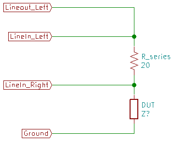
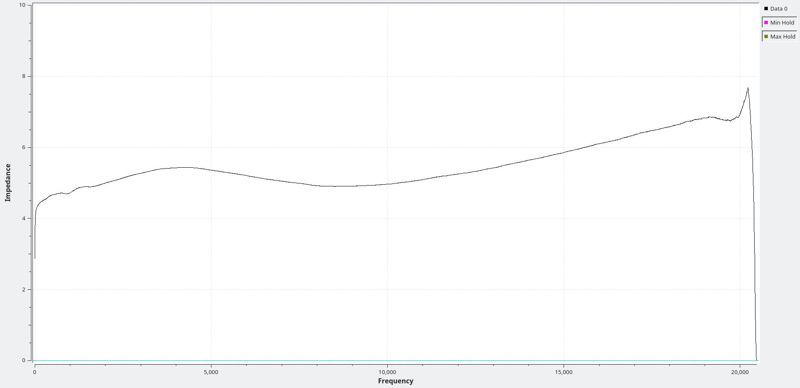

# Simple impedance tester
This is a [GNU Radio](https://www.gnuradio.org/) based audio frequency impedance tester.

You will need a little bit of hardware to use this program.

|Required hardware|
|-----------------|
||

You'll need a PC with a soundcard that has "Line In" and "Line Out" jacks.  You'll need [GNU Radio](https://www.gnuradio.org/), [Python 2](https://www.python.org/downloads/), and [SciPy](https://www.scipy.org/).

You'll also need this software.

Open "Impedanceplotte.grc" with the GNU Radio Companion.  Enter the value of the series resistor, hook up your speaker or other device as shown in the drawing, then give the software a few seconds to analyze the impedance.

|Sample impedance plot of a car stereo speaker|
|---------------------------------------------|
||

Have a look at my [blog posts](https://josepheoff.github.io/posts/1gnuradio-toc) and the [wiki](https://github.com/JosephEoff/Simple-impedance-tester/wiki) for more information on the setup and use of the simple impedance tester.

